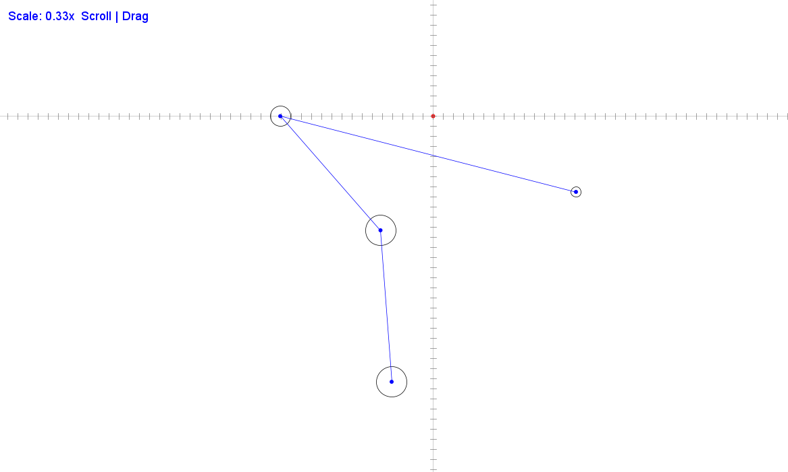
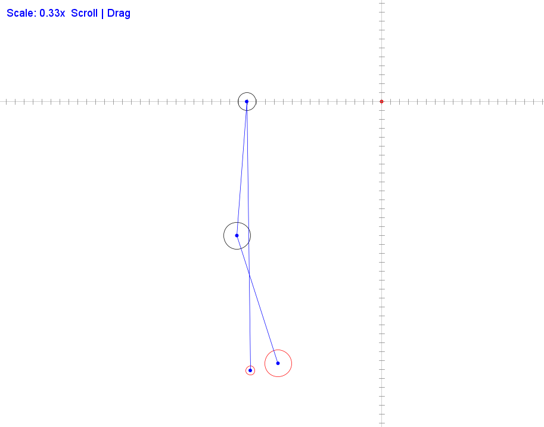

# Physics Sandbox - 2D物理沙盒游戏引擎

> 一个基于Spring框架的2D物理沙盒游戏引擎，提供完整的物理模拟、事件系统和组件化架构。

## ✨ 特性

- **物理模拟系统** - 基于Verlet积分的刚体动力学，支持质量、重力、碰撞检测和约束求解
- **事件驱动架构** - 可扩展的事件总线系统，支持事件池复用和异步分发
- **组件化设计** - 灵活的GameObject-Component模型，支持运行时动态添加/移除组件
- **多阶段执行器** - 按CLEAN → EVENT → COMPONENTS → PHYSICS → UPDATE → COLLISION → CONSTRAINT → RENDER顺序更新
- **碰撞检测与约束求解** - 基于空间划分的碰撞检测，顺序脉冲法求解器支持DistanceConstraint和ColliderConstraint
- **可视化调试** - 支持平移/缩放的可视化窗口，实时显示物体位置、碰撞状态和约束线条

## 🏗️ 项目架构

```text
┌────────────────────────────────────────────────────────────┐
│ FrameManager                                               │
├────────────────────────────────────────────────────────────┤
│    ┌─────────────┐ ┌─────────────┐ ┌─────────────────────┐ │
│    │ LifeCycle   │→│ EventBus    │→│ ComponentUpdater    │ │
│┌ → │ Manager     │ │ (EVENT)     │ │ (COMPONENTS)        │ │
││   │ (CLEAN)     │ │             │ └─────────────────────┘ │
││   └─────────────┘ └─────────────┘            ↓            │
││   ┌─────────────┐ ┌─────────────┐ ┌─────────────────────┐ │
││   │ Collider    │←│ Physic      │←│ PhysicAnalyzer      │ │
││   │ Analyzer    │ │ Updater     │ │ (PHYSICS)           │ │
││   │ (COLLISION) │ │ (UPDATE)    │ │                     │ │
││   └─────────────┘ └─────────────┘ └─────────────────────┘ │
││          ↓                                                │
││   ┌─────────────────────────────────────────────────────┐ │
│└ ─ │ ConstraintSolver                                    │ │
│    │ (CONSTRAINT)                                        │ │
│    └─────────────────────────────────────────────────────┘ │
│                     ↓   Fixed Update Complete              │
│ ┌────────────────────────────────────────────────────────┐ │
│ │ Renderer                                               │ │
│ │ (RENDER)                                               │ │
│ └────────────────────────────────────────────────────────┘ │
└────────────────────────────────────────────────────────────┘
```

## 📦 核心模块

### 1. 生命周期管理 (`lifecycle`)
- **LifeCycleManager**: 管理所有GameObject和Component的生命周期
- **GameObjectProxy**: 代理模式实现的安全引用，防止访问已销毁对象

### 2. 事件系统 (`event`)
- **EventBus**: 事件分发中心，支持时间戳排序和批量分发
- **EventRegistry**: 事件对象池，避免频繁GC
- **EventListener<T>**: 泛型监听器，自动解析事件类型

### 3. 物理系统 (`physics`)
- **Transform**: Verlet积分器，支持位置/速度/加速度
- **RigidBody**: 刚体组件，支持质量、重力、运动学控制
- **Collider**: 碰撞体抽象（已实现RoundCollider）
- **Constraint**: 约束系统（DistanceConstraint、ColliderConstraint）
- **ColliderAnalyzer**: 空间哈希加速的碰撞检测

### 4. 渲染系统 (`render`, `swing`)
- **Renderer**: 组件执行器
- **GraphicFrame**: 可交互的Swing窗口，支持鼠标拖拽平移和滚轮缩放

## 🚀 快速开始

### 环境要求
- JDK 17+
- Maven 3.6+
- SpringBoot 6+

### 运行示例

```java
public class MainApplication {
    public static void main(String[] args) {
        // Spring Boot启动
        ApplicationContext context = new SpringApplicationBuilder(MainApplication.class)
                .web(WebApplicationType.NONE)
                .headless(false)
                .run(args);

        // 获取窗口
        GraphicFrame frame = context.getBean(GraphicFrame.class);
        
        // 创建游戏对象
        GameObjectFactory factory = context.getBean(GameObjectFactory.class);
        GameObject ball = factory.create("Ball");
        
        // 添加组件
        ball.getTransform().setPosition(new Vector2(100, 0));
        ball.addComponent(new RoundCollider(10));
        
        RigidBody rb = new RigidBody();
        rb.setGravity(true);
        rb.setMass(5.0);
        ball.addComponent(rb);
        
        ball.addComponent(frame.createPanelRenderer());
        
        // 启动游戏循环
        FrameManager manager = context.getBean(FrameManager.class);
        manager.run();
    }
}
```

## 🎮 使用示例
- 创建距离约束
```java
DistanceConstraint.create(objectA, objectB, distance);
```
- 发布自定义事件
```java
// 1. 定义事件
public class MyEvent extends Event {
    private String data;
}

// 2. 注册到事件池
eventRegistry.register(MyEvent.class, MyEvent::new, 100);

// 3. 创建监听器
@Component
public class MyListener extends EventListener<MyEvent> {
    @Override
    public void onEvent(MyEvent event) {
        // 处理事件
    }
}

// 4. 发布事件
MyEvent event = eventRegistry.get(MyEvent.class);
event.setData("Hello");
eventBus.publish(event);
```

## ⚙️ 配置项
- 在 application.properties 或 application.yml 中配置：
```yaml
settings:
  physics:
    calculate_frames_per_second: 480    # 物理计算帧率
    constraint_iterate_time: 6          # 约束求解迭代次数
```

## 📊 性能优化
- Verlet积分 - 比Euler积分更稳定，计算开销更低
- 快速逆平方根 - 使用Quake III算法优化归一化计算
- 事件对象池 - 避免事件创建开销
- 空间哈希 - O(1)的碰撞检测邻居查找
- CopyOnWriteArrayList - 安全的事件监听器迭代

## 🧪 测试
- 项目包含基本的单元测试和集成测试：

```bash
# 运行所有测试
mvn test

# 运行特定测试
mvn test -Dtest=Vector2Test
mvn test -Dtest=ConstraintValidationTest
```

## 📝 开发日志
- v1.0 已完成
  - ✅ 核心游戏循环与帧调度
  - ✅ GameObject-Component架构 
  - ✅ 事件总线与对象池 
  - ✅ 生命周期管理 
  - ✅ Verlet积分物理引擎 
  - ✅ 圆形碰撞检测 
  - ✅ 距离约束（连杆） 
  - ✅ 碰撞约束与弹性碰撞 
  - ✅ Swing可视化窗口 
  - ✅ 日志系统（log4j2）
- 待优化 
  - 🔲 多边形碰撞体支持 
  - 🔲 刚体旋转 
  - 🔲 材质与摩擦力 
  - 🔲 音频系统 
  - 🔲 场景序列化 
  - 🔲 性能profiling工具

## 示例
- 物体约束:

- 碰撞后几帧内，碰撞体圆将变色:


Physics Sandbox 是一个学习性质的游戏引擎项目，旨在探索2D物理模拟和游戏架构设计。